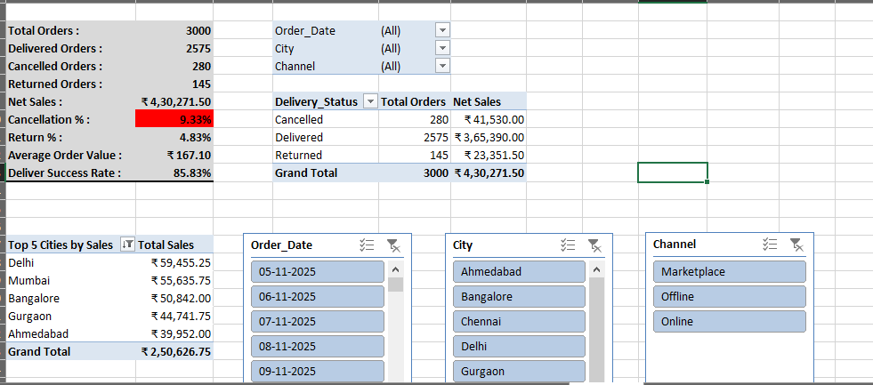
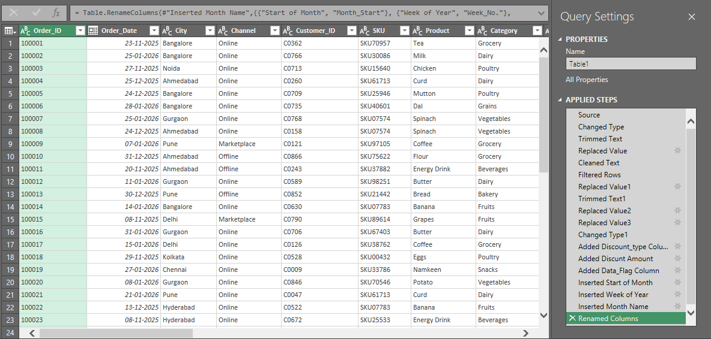
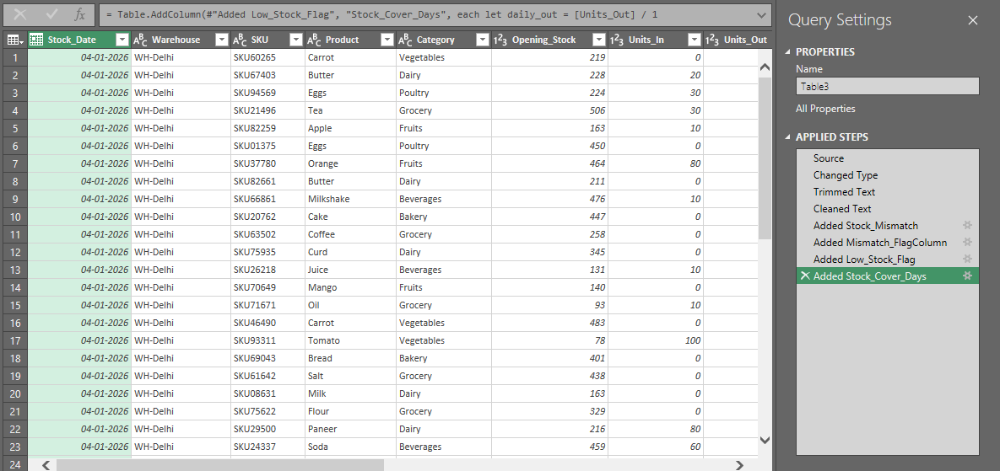

# 📊 Operations MIS Reporting Project (Excel + Power Query)

An Excel-based MIS reporting system that cleans raw operational data and generates daily sales and inventory dashboards.

## 🔧 Tools Used

* Microsoft Excel
* Power Query
* Pivot Tables
* KPI Calculations

## 📌 Project Overview

This project simulates real-world MIS workflows including data cleaning, validation, and management reporting.

### Key Features

* Automated data cleaning using Power Query
* Discount standardization and data validation
* Daily sales MIS dashboard with KPIs
* Inventory monitoring with low stock alerts
* Filterable reports using slicers

## 📷 Dashboard Screenshots

### MIS Daily Dashboard

### Inventory MIS

### Power Query Cleaning

 Raw_Order_Cleaning

 Inventory_Cleaning

## 📁 Files Included

* `Operations_MIS_Reporting_Project.xlsx` — Full Excel project file

## 🎯 Skills Demonstrated

* Data cleaning & transformation
* KPI reporting
* Operational MIS design
* Excel dashboarding

